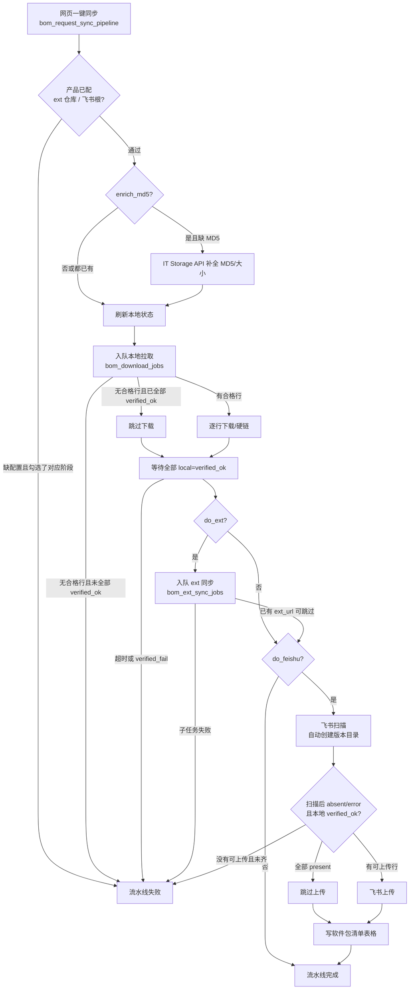
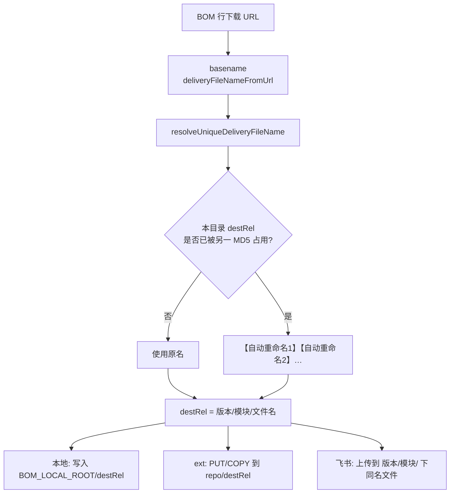
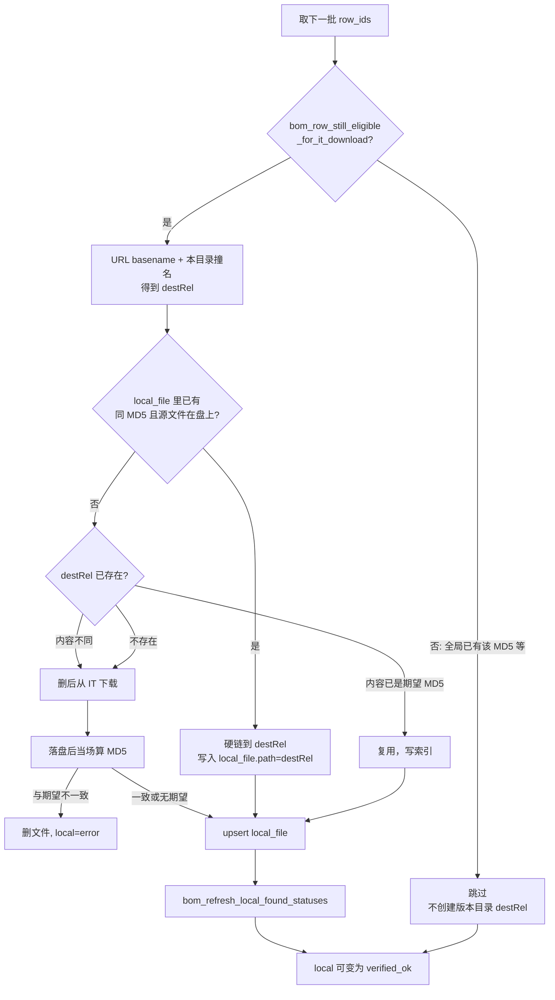
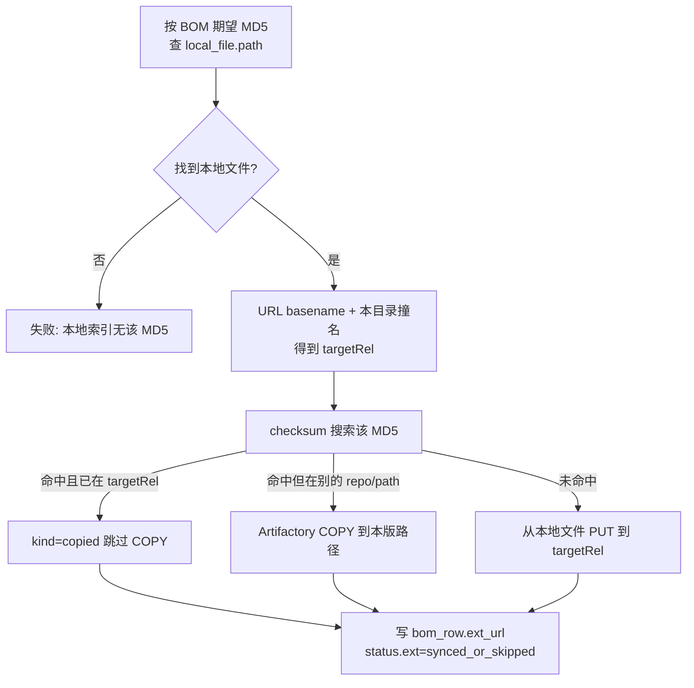
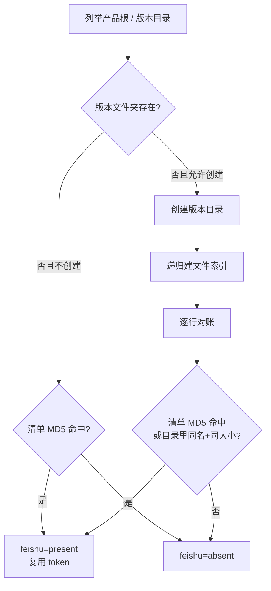
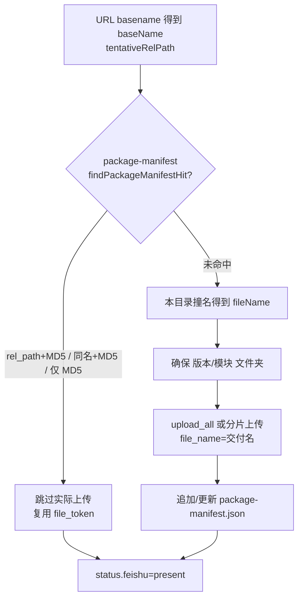
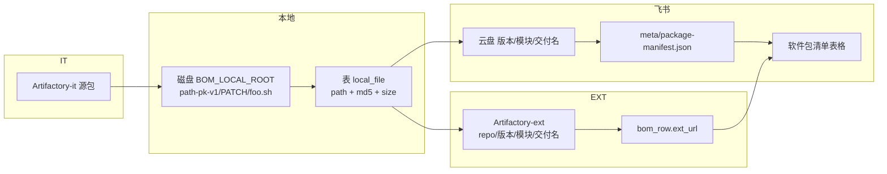
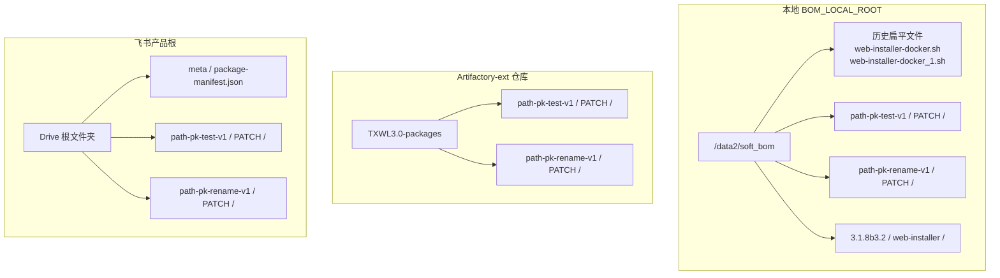

# BOM 同步流水线：下载 / Artifactory-ext / 飞书

对照实现用流程图。入口是网页「一键同步」入队 `bom_sync_pipeline_jobs`（`bom_request_sync_pipeline`），worker 在 `syncPipelineWorker.mjs` 里串起子任务。也可单独触发下载、ext、飞书上传。

**交付名约定（三端共用）**：默认用下载 URL 的 basename，不是本地盘上的 `_N` 旧名。仅当**同一目标目录**里已被**另一份不同 MD5**占用时，改成 `【自动重命名N】` + 原名（复合后缀如 `.tar.gz` 留在最后）。同名同 MD5 不去撞名、去重复用。

实现：`apps/bom-scanner-worker/src/deliveryFileName.mjs` 的 `resolveUniqueDeliveryFileName`。

目标相对路径：

```text
{版本目录 batchName}/{模块优先否则组件}/{交付文件名}
```

目录树、以及「文件名重复 × MD5 重复」的三端对照与 sample，见下文 **§8、§9**。

---

## 1. 总览



阶段顺序（`executeSyncPipelineJob`）：

`enrich_md5` → `download` → `wait_verified` → `ext_sync` → `feishu_scan` → `feishu_upload` → `version_sheet` → `done`

`wait_verified` 只认 BOM 行 `status.local = verified_ok`。该状态来自「期望 MD5 是否出现在 `local_file` **任意 path**」，**不要求**版本目录下已有对应交付名。

---

## 2. 三端如何决定文件名



| 端 | 占用检查 | 内容从哪来 | 去重 |
| --- | --- | --- | --- |
| 本地 | 本任务 `claimedDestRel` + 磁盘/`local_file` 上该 `destRel` | IT 新下，或按 MD5 硬链已有文件 | **全局 MD5 已在 `local_file` 则整行跳过**（见 §3 注意） |
| ext | 本任务 `claimedExtRel`（不管飞书/本地名） | `local_file` 按 MD5 找到的磁盘文件 | Artifactory checksum：已有则 COPY 到本版路径，没有则 PUT |
| 飞书 | 本任务 `reservedRelPaths` + `package-manifest.json` 的 `rel_path` | 同上，按 MD5 找本地文件 | 清单按 MD5（兼容旧 `_N` 名）；命中则复用 `file_token`，不传第二份 |

本地盘上的历史名（`web-installer-docker_1.sh`）**不会**传到 ext / 飞书。那两路都从 URL 原名重新编号。

---

## 3. 本地拉取（IT 下载）

入队：`bom_request_download` / `bom_worker_enqueue_download`。  
合格行：URL 像 it-artifactory，且期望 MD5 **尚未**出现在 `local_file`（或没有期望 MD5），且 `status.local` 允许再拉。



**检查时注意：**

- `verified_ok` ≠ 版本目录里有交付名。MD5 在根目录 `web-installer-docker_1.sh` 也会过校验。
- 整行跳过发生在算 `destRel` **之前**，本批后一行看不到前一行占了原名，本地交付名可能和飞书/ext 不一致。
- 硬链成功时 `nlink≥2`；若只跳过不硬链，版本目录会缺文件。

`local_file` 是暂存盘索引：主键 `path`，另有 `size_bytes`、`mtime`、`md5`。与 BOM 行只靠 MD5 关联。

---

## 4. 同步到 Artifactory-ext

入队：`bom_request_ext_sync`。合格行：`local = verified_ok` 且尚无 `ext_url`。



ext 路径与飞书相对路径应对齐：

```text
{extRepo}/{batchName}/{模块}/{交付文件名}
```

`ext_url` 的 `path=` 查询参数应等于飞书清单「相对路径」。

---

## 5. 飞书：扫描 → 上传 → 软件包清单

### 5.1 扫描

流水线会 `auto_create_version_folder=true`，在产品飞书根下确保版本文件夹存在，并加载 `meta/package-manifest.json`。



扫描错误含「本地索引中无该 MD5」或「缺少合法期望 MD5」时，流水线**不会**把该行送去上传。

### 5.2 上传

入队：本地 `verified_ok` 且飞书 `absent|error`。内容仍按 MD5 从 `local_file` 取文件。



清单主键是 `rel_path`，不是全局 `file_name`。去重仍优先 MD5：旧 `_N` 名也能命中，不重复传字节。跨版本同 MD5 会跳过上传，新版本目录里可能没有第二份副本，行上仍有 token。

### 5.3 软件包清单表格

`feishuVersionSheet.mjs`：按 BOM 行列出版本表格，相对路径优先用清单命中的 `rel_path`，应与 `ext_url` 的 path 一致。

---

## 6. 数据落在哪



---

## 7. 检查对照（文件名是否三边一致）

对每一行同时看：

1. 飞书云盘实名 / 清单 `rel_path` 末段  
2. `ext_url` 的 `path=` 末段  
3. 本地 `{BOM_LOCAL_ROOT}/{rel_path}` 是否存在，且 MD5 等于 BOM 期望值  

**应一致：** 1 与 2（同一套交付名）。  
**当前实现下 3 可能不一致：** 全局 MD5 已在 `local_file` 时下载整行跳过，版本目录缺文件或沿用错误原名；ext/飞书仍按本批顺序编号。

同 MD5 跨版本：飞书/ext 允许两个 `rel_path` 都叫 `web-installer-docker.sh`；飞书可能只存一份 token。本地若修好硬链，两个版本目录应各有一条 path（可同 inode）。

---

## 8. 三端目录结构

中间层目录：BOM 有「模块」用模块，否则用「组件」。下面 sample 都用 `PATCH`。

生产本地根：`BOM_HOST_STORE`（例 `/data2/soft_bom`）→ 容器 `/bom_store`。  
ext 根：产品字段 `ext_artifactory_repo`（例 `TXWL3.0-packages`）。  
飞书根：产品字段 `feishu_drive_root_folder_token`（每个产品一个 Drive 文件夹）。



同一套相对路径应对齐（飞书清单「相对路径」= ext `path=` = 本地相对 `BOM_LOCAL_ROOT`）：

```text
{batchName}/{模块或组件}/{交付文件名}
```

### 8.1 文本树 sample（设计形态）

假设产品 ext 仓库 `TXWL3.0-packages`，两个版本，模块都是 `PATCH`。

```text
本地 /data2/soft_bom/
├── path-pk-test-v1/PATCH/
│   ├── web-installer-docker.sh          # MD5-α
│   ├── make_build_prereqs_bundle.sh     # MD5-δ
│   └── tf_deploy_20250306.tar.gz        # MD5-ε
└── path-pk-rename-v1/PATCH/
    ├── web-installer-docker.sh                 # MD5-β  原名空闲，不改名
    ├── 【自动重命名1】web-installer-docker.sh    # MD5-γ
    └── 【自动重命名2】web-installer-docker.sh    # MD5-ζ

Artifactory-ext  TXWL3.0-packages/
├── path-pk-test-v1/PATCH/   （同上三个原名）
└── path-pk-rename-v1/PATCH/ （同上：原名 + 【自动重命名1】+ 【自动重命名2】）

飞书产品根/
├── meta/package-manifest.json           # 主键 rel_path，全局按 MD5 去重 token
├── path-pk-test-v1/PATCH/               （同上三个原名）
└── path-pk-rename-v1/PATCH/             （同上三份交付名）
```

根目录那些 `web-installer-docker_1.sh` 是**旧全局撞名**留下的内容池，不是交付路径。ext / 飞书不会用 `_1` 这种名字。

### 8.2 谁认哪一层

| | 本地 | ext | 飞书 |
| --- | --- | --- | --- |
| 版本目录 | 磁盘子目录 + `local_file.path` 前缀 | 仓库内文件夹 | Drive 子文件夹（扫描可自动建） |
| 模块目录 | 同上 | 同上 | 同上 |
| 文件名 | 下载后/硬链后的 basename | PUT/COPY 的 artifact 名 | 上传 `file_name` |
| 额外索引 | 表 `local_file`（path 主键） | `bom_row.ext_url` | `package-manifest.json` + 行 `status.feishu_*` |

---

## 9. 文件名重复 × MD5 重复：三端怎么处理

先看 **是否同一目标目录**（同一 `版本/模块/`）。文件名是否重复、MD5 是否重复，只在这个前提下才有「撞名改名」。

下面 MD5 用短标签：`α β γ`；文件名默认 URL 都是 `foo.sh`。

### 9.1 总表

| # | 范围 | 文件名 | MD5 | 本地（现状） | 本地（设计：应落到 destRel） | ext | 飞书 |
| --- | --- | --- | --- | --- | --- | --- | --- |
| A1 | 同目录 | 同 | 同 | 第二行因全局 MD5 已在索引而**整行跳过**；`verified_ok` | 原名，硬链到同一 `destRel`，不改名 | checksum 已在 `targetRel` → 跳过 COPY；写同一 `ext_url` | 清单 MD5 命中 → 不传，复用 token |
| A2 | 同目录 | 同 | 不同 | 若第一份被跳过，第二份会误用原名 | 第二份 `【自动重命名1】foo.sh` | 与设计相同：第二份改名前缀后 PUT/COPY | 与设计相同：改名后上传，两个 token |
| A3 | 同目录 | 不同 | 同 | 第二行常跳过，第二个 destRel 可能没有 | 两个文件名，硬链同一 inode | checksum 命中 → COPY 到**新路径**（仓库里两份路径、一份内容） | **全局 MD5 去重**：不传第二份；新路径目录里可能没有文件，行上复用 token |
| A4 | 同目录 | 不同 | 不同 | 各下各的 | 两个原名 | 两个 PUT/COPY | 两个上传 |
| B1 | 跨目录 | 同 | 同 | 第二版常跳过，版本目录缺文件 | 两目录都叫 `foo.sh`，硬链 | COPY 到第二版路径 | MD5 去重，第二版文件夹可能没有副本 |
| B2 | 跨目录 | 同 | 不同 | 各版可用原名（若都真正落盘） | **都用原名**（`rel_path` 主键） | 都用原名，各 PUT/COPY | 都用原名，各传一份 |
| B3 | 跨目录 | 不同 | 同 | 同 B1：第二版可能跳过 | 硬链到各自路径 | COPY 到新路径 | MD5 去重，可能无第二份云盘文件 |
| B4 | 跨目录 | 不同 | 不同 | 互不影响 | 互不影响 | 互不影响 | 互不影响 |

「同目录」= 同一 `{batchName}/{模块}/`。「跨目录」= 不同版本，或同版本不同模块。

### 9.2 Sample A1 — 同目录、同名、同 MD5（再跑一遍 / 重复行）

BOM 两行（或跑两次同步），URL 都是 `.../foo.sh`，MD5 都是 `α`。

```text
期望：
  v1/PATCH/foo.sh    α   （一份内容）

本地设计：第二次硬链到同一 destRel，索引仍是这一条 path。
本地现状：第二次「已有 MD5」跳过，只要 α 在任意 path 就会 verified_ok。

ext：checksum 找到已在 TXWL3.0-packages/v1/PATCH/foo.sh → 不 COPY。
飞书：manifest 已有 md5=α → kind=dedup，不上传。
```

### 9.3 Sample A2 — 同目录、同名、不同 MD5（撞名改名）

对应测试 BOM `path-pk-rename-v1`：同一 `PATCH/` 三行 URL 都叫 `web-installer-docker.sh`。

```text
URL 原名都是 web-installer-docker.sh

  行1  MD5-β  20085B  →  web-installer-docker.sh
  行2  MD5-γ  20447B  →  【自动重命名1】web-installer-docker.sh
  行3  MD5-ζ  22316B  →  【自动重命名2】web-installer-docker.sh
```

- **ext / 飞书（实测一致）**：按本批顺序编号，三份都在 `path-pk-rename-v1/PATCH/`。
- **本地现状（实测不一致）**：β、ζ 以前在根目录叫 `web-installer-docker_2.sh` / `_3.sh`，整行跳过；γ 新下载时原名空闲，写成了 `web-installer-docker.sh`（少了前缀）。

### 9.4 Sample A3 — 同目录、不同名、同 MD5

少见：两个 URL basename 不同，内容相同。

```text
行1  .../foo.sh      MD5-α
行2  .../foo-old.sh  MD5-α   同一字节
```

| 端 | 结果 |
| --- | --- |
| 本地设计 | `v1/PATCH/foo.sh` 与 `v1/PATCH/foo-old.sh` 硬链，同一 inode |
| ext | checksum 命中后 COPY 到 `.../foo-old.sh`，仓库里两条路径 |
| 飞书 | 第二行清单按 MD5 命中，**不创建** `foo-old.sh`，两行共用 token |

### 9.5 Sample A4 — 同目录、不同名、不同 MD5（普通多文件）

```text
v1/PATCH/web-installer-docker.sh         α
v1/PATCH/make_build_prereqs_bundle.sh    δ
v1/PATCH/tf_deploy_20250306.tar.gz       ε   ← 复合后缀不会被截成 .gz
```

三端都原名落盘。对应测试 BOM `path-pk-test-v1` 的 ext/飞书形态。本地若 α、ε 早已在根目录，现状可能只有 `make_build_prereqs_bundle.sh` 在版本目录里。

### 9.6 Sample B2 — 跨版本、同名、不同 MD5（这次改主键要保证的）

```text
path-pk-test-v1/PATCH/web-installer-docker.sh     MD5-α
path-pk-rename-v1/PATCH/web-installer-docker.sh   MD5-β
```

两边都可以叫原名，**不会**因为 4.7 已经有 `foo.sh` 就逼 4.8 改成 `【自动重命名1】`。  
飞书 `package-manifest` 两条 `rel_path`、两个 token。ext 两个 artifact。

### 9.7 Sample B1 — 跨版本、同名、同 MD5（内容去重）

```text
4.7/PATCH/foo.sh  MD5-α   先上传
4.8/PATCH/foo.sh  MD5-α   再同步
```

| 端 | 结果 |
| --- | --- |
| 本地设计 | 两处 `foo.sh`，硬链 |
| 本地现状 | 4.8 下载跳过，只有 4.7（或根目录旧 path）有文件；4.8 仍 `verified_ok` |
| ext | checksum COPY 到 `4.8/PATCH/foo.sh`，仓库两路径一份内容 |
| 飞书 | 第二行 dedup，**4.8 文件夹里可能没有 foo.sh**，表格仍给 4.7 那个 `file_token` |

### 9.8 对照时怎么读

1. 先问：是不是同一个 `{版本}/{模块}/`？不是则文件名重复也不是撞名。  
2. 再问：MD5 是否相同？相同 → 飞书倾向不传第二份；ext 倾向 COPY 到新路径；本地现状倾向整行不拉。  
3. 只有「同目录 + 同名 + 不同 MD5」才会出现 `【自动重命名N】`。  
4. 飞书云盘缺文件但行上 `present`，优先怀疑 MD5 去重，而不是改名失败。
