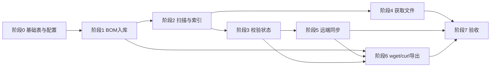

# software-bom-admin（Lite）实现路线图

风险与决策点在进入到某个实现阶段时，可进行详细设计时进行澄清。

本文档依据 [prd.md](./prd.md) 制定，用于指导开发与验收顺序；与 PRD 冲突时以 PRD 为准。

---

## 目标摘要

在单一部署上实现：**BOM 自由结构入库（jsonb）→ 本地扁平目录暂存与索引 → MD5 校验 → ext-Artifactory 查重与上传 → 告警与离线 wget/curl 导出**。规模假设：BOM 行数小于 1000，优先功能与数据模型，性能/存储/安全不作为 Lite 版硬约束。

---

## 阶段 0：基础与数据层

| 项 | 说明 |
|----|------|
| 技术栈对齐 | 与现有仓库（React + Vite + Supabase 等）对齐；确认服务端扫描/定时任务运行位置（同一 Node 进程、独立 worker 或 Edge Function 能力边界）。 |
| 核心表：BOM 行 | 表存 `bom_row jsonb` 为唯一事实来源；元数据列仅 `id`、批次/名称、创建时间等；**不**重复存 URL、清单 MD5 为独立业务列。 |
| 核心表：`local_file` | `path`、`size`、`mtime`、`md5`；主键策略 `(path)` 或 `id` + `path` 唯一，与 PRD §5、§6 一致。 |
| 配置存储 | 可配置项：本地根目录（如 `/data/bom_store/`）、扫描间隔（1–60 分钟）、BOM 行内「下载路径」「MD5」「硬件平台」等 **key 映射**（支持多 key 兼容）。 |
| 状态枚举 | 统一业务状态机：`待处理`、`待人工下载`、`本地已发现`、`校验通过`、`校验失败`、`已转存（或跳过）`、`异常`；落库或计算字段方案在实现前定稿。 |

**里程碑**：迁移可应用；空壳页面能读配置。

---

## 阶段 1：BOM 入库与解析层

| 项 | 说明 |
|----|------|
| 粘贴入库 | 用户粘贴表格/文本 → 按行写入；列名/版式不假设永久不变，整行进 `jsonb`。 |
| 覆盖与编辑 | 支持整表多次粘贴覆盖；UI 可编辑 jsonb 映射字段（含手补 MD5）。 |
| 宽松校验 | 按配置 key 检查「下载路径」「MD5」是否存在；**仅告警，不拒绝入库**。 |
| 告警列表 | 持久化或计算「缺少路径、MD5 非法/缺失」等提示，供告警页展示。 |

**里程碑**：验收 PRD §3、§8 告警相关基础；任意列结构入库后原貌保留。

---

## 阶段 2：本地目录、扫描与索引

| 项 | 说明 |
|----|------|
| 扁平目录 | 使用单一根目录；可被清空或缺文件，与「本地暂存可丢失」一致。 |
| 扫描任务 | 可配置间隔；**手动触发扫描**（设置页可查看最近任务与时间戳）。 |
| 索引逻辑 | 全量或小体量全扫；**仅当** size/mtime 相对库中记录变化、或尚无有效 MD5 时读盘计算 MD5；元数据未变且已有 32 位 hex 则跳过哈希；文件消失则删行或软删（二选一整站统一）。 |
| BOM ↔ 文件关联 | 通过 **MD5** 将 `local_file` 与 BOM 行关联；多 BOM 共用同一物理文件。 |
| 命名规范（可选后置） | `{baseName}__{arch}__{shortMd5}.{ext}`：可与「仅索引不重命名」分步，先通关联再补重命名与 `local_stored_name`（jsonb）。 |

**里程碑**：索引表字段与 PRD §6 一致；扫描驱动状态向「本地已发现」等过渡。

---

## 阶段 3：MD5 校验与展示状态

| 项 | 说明 |
|----|------|
| 期望 MD5 | 从 `jsonb` 按配置 key 读取；与本地实测 MD5 比对。 |
| 状态更新 | `校验通过` / `校验失败`；路径下无文件时展示「本地未找到」类文案，扫描可恢复。 |
| 非 it 来源 | 无自动下载时进入「待人工下载」，拷贝入目录后由扫描更新。 |

**里程碑**：统一状态机对用户单一语义；验收「本地索引 + 校验」相关条目。

---

## 阶段 4：获取文件（it-artifactory 与其他）

| 项 | 说明 |
|----|------|
| it-artifactory | 识别链接，用 API Key（服务端配置）下载到约定目录；与 jsonb 解析的路径字段对齐。 |
| 其他来源 | 仅提示用户自行下载并拷贝到约定目录；依赖扫描更新状态。 |
| 异常状态 | 下载失败等进入「异常」并可追溯原因（简要即可）。 |

**里程碑**：自动下载与人工路径两条路径可跑通至索引与校验。

---

## 阶段 5：ext-Artifactory 同步

| 项 | 说明 |
|----|------|
| 前置条件 | **仅在校验通过后**再查重/上传（与 PRD §7.3 一致）。 |
| 查重 | 调用 Checksum Search（如 `api/search/checksum?md5=...`）；已存在则只写回 **已有 URI** 到 jsonb（如 `ext_url`）。 |
| 上传 | 不存在则部署；远端路径：`{repo}/{md5前2位}/{完整32位md5小写}/{存储用文件名}`，避免重名覆盖。 |
| 状态 | 「已转存（或跳过）」区分「仅记 URI」与「新上传成功」。 |

**里程碑**：验收「完整 MD5 入路径 + checksum 查重 + 不因重名覆盖错文件」。

---

## 阶段 6：一键生成 wget/curl（§9）

| 项 | 说明 |
|----|------|
| 范围 | 指定 BOM 或勾选行；**原始 URL** 与 **ext URI** 分开展示或分段导出。 |
| 工具 | 支持 wget / curl 切换或同时生成；输出目录参数与 §5 命名建议对齐（可选「建议文件名」）。 |
| 鉴权 | **默认**脚本内不硬编码密钥；`Authorization: Bearer $EXT_ARTIFACTORY_TOKEN` 等占位 + 注释说明；it 与 ext 变量可区分。 |
| 边界行 | 无 ext 的行：跳过并说明，或注释占位；网盘/Cookie 等无法推断的附注释提示人工处理。 |
| 交付 | 剪贴板；可选下载 `.sh`（shebang、`set -euo pipefail` 可选）。 |

**里程碑**：验收 PRD §9 与 §10 最后一条。

---

## 阶段 7：整体验收与打磨

| 项 | 说明 |
|----|------|
| 走通 E2E | 从粘贴 BOM → 下载/拷贝 → 扫描 → 校验 → 同步 → 导出脚本。 |
| 配置与运维文档 | 目录权限、Artifactory API、环境变量命名（与导出脚本一致）。 |
| 已知 Lite 范围 | 不展开性能压测、高可用与细粒度权限模型，除非后续版本单列。 |

---

## 依赖关系（简图）

说明：阶段 6 依赖 BOM 数据与（可选）ext URI，可与阶段 4/5 并行开发前半段（仅原始链接导出），但**完整验收**需阶段 5 完成。

---

## 风险与决策点（实现前建议拍板）

1. **扫描与 MD5 计算**：服务端长期进程 vs 定时触发 CLI；大文件 MD5 是否异步队列。  
2. **jsonb 键名**：首版固定一套默认映射 + 管理界面可改，避免硬编码散落。  
3. **重命名策略**：先算 MD5 再重命名 vs 占位后重命名，PRD 要求二选一整站写死。  
4. **Artifactory**：具体实例 URL、仓库名、认证方式与 Checksum API 路径以环境为准，在配置中体现。

---

*文档版本：与 prd.md 当前内容对齐；PRD 变更时请同步更新本路线图。*
